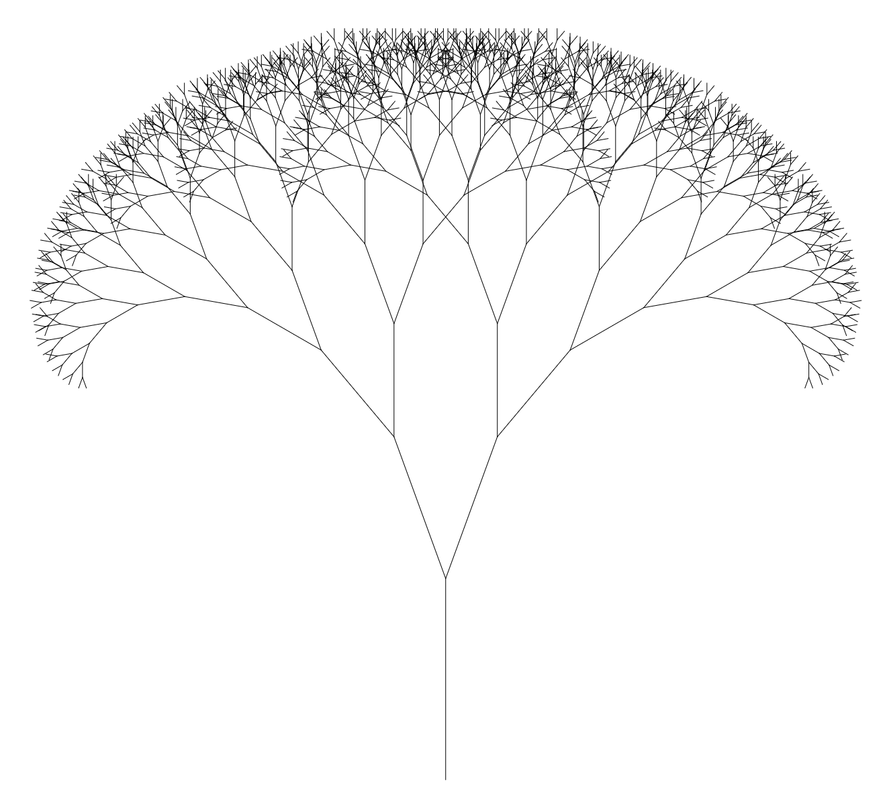
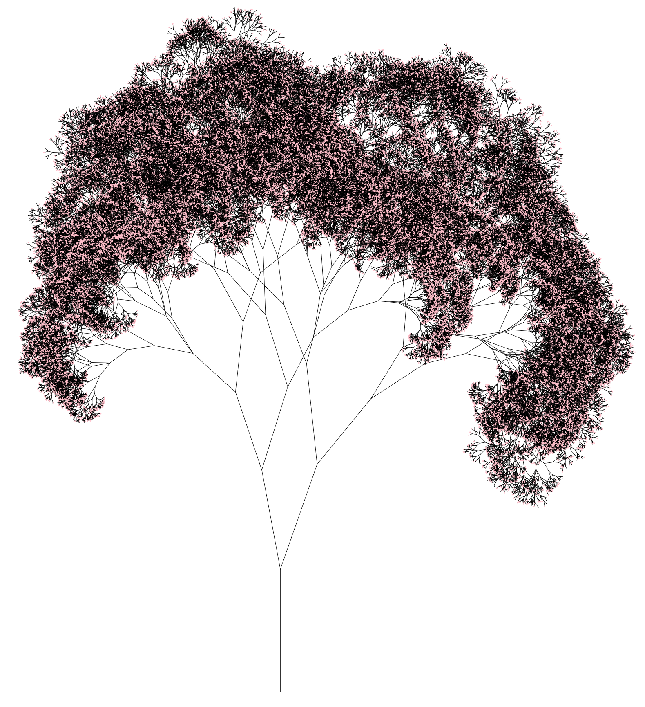

Create a JavaFX GUI which draws a recursive tree.
The basic recursive tree should look like this:

You will notice that the tree begins with a single root branch and at each
forking point, the left and right forks are scaled and rotated
versions of the entire tree structure. 
This visualises the concept of recursion in programming. 
Patterns with this recursive structure are known as fractals.
A fractal [may be described as](https://books.google.com.au/books?id=mgvyBwAAQBAJ&pg=PA11&redir_esc=y#v=onepage&q&f=false):
 "a shape made of parts similar to the whole in some way". 

Modify the JavaFX class `comp1110.homework.X01.RecursiveTree` to generate a
tree with this structure.

Hints:
* In any recursive algorithm, you need a base case. Think about how you
might terminate the forking of the recursive tree.
* Within the provided base class, there are some objects imported from
the JavaFX libraries that you may find helpful (namely [Rotate](https://docs.oracle.com/javase/8/javafx/api/javafx/scene/transform/Rotate.html),
[Line](https://docs.oracle.com/javase/8/javafx/api/javafx/scene/shape/Line.html) and [Point2D](https://docs.oracle.com/javase/8/javafx/api/javafx/geometry/Point2D.html)). Click these links to find out more information about
these classes.
* Your tree might not look identical to the picture provided; that is
fine. You might like to make the parameters of your program
adjustable.

Extension:
It is amazing what you can generate with some basic modifications to
what you have created above. Here is an example:

Modify your code to make it more customizable. Post a picture of an
interesting tree you have made onto Piazza!

Some ideas for modifications include:
* Different numbers of branches at each fork point
* Different rotation amounts at each fork 
* Flowers/blossoms at the end of the branches (or maybe at other
points)
* Different relative branch lengths (i.e. different scaling of branches at each fork point)
* Different colours for different components 
* Curved/jagged branches